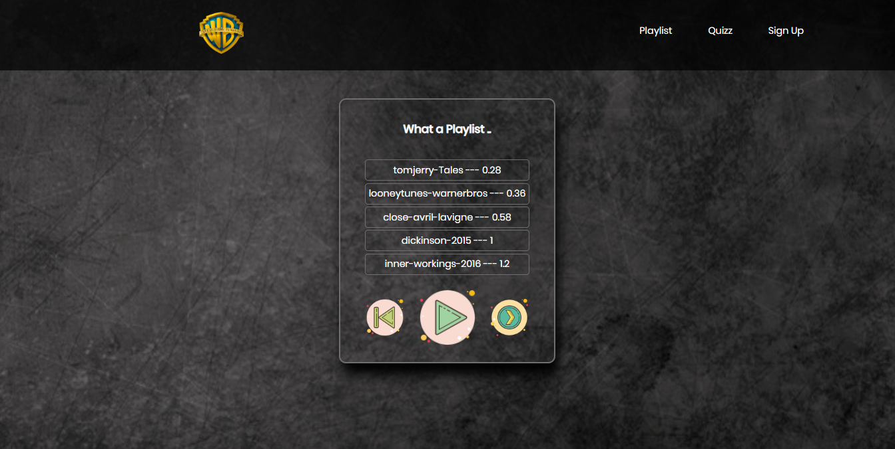

# Name

Amazing Playlist

## Description


TRYING TO RECREATE THE SINGLE PAGE APPLICATION ARCHITECTURE USED FOR EXAMPLE IN (REACT JS)

We will have like the title says an amazing playlist wich let us read some medias (Song and movies)
Adding to that we will have a quizz so that the visitor can play and listen to his favourite track
and for more advanced operation we could imagine that after the visitor register in our Website he could
access some forbidden features



## Features

The most important difference between class- and prototype-based inheritance is that a class defines a type which can be instantiated at runtime, whereas a prototype is itself an object instance.

in our project we used prototype-base inheritance so we could master to basics and that will allow us to easly get the class-based inheritance

We defined the following objects for the Playlist

- Media
- Song
- Movie

Song and movie inherit from Media using (prototype) like for example for movie

```javascript
function Movie(year, title, duration, isPlaying) {
  this.year = year;
  // Calling the Constructor of Media
  Media.call(this, title, duration, isPlaying);
}
// creating the Movie prototype from the Media proto
Movie.prototype = Object.create(Media.prototype);

// replacing the constructor of Movie (wich for the moment is Media) with Movie
Movie.prototype.constructor = Movie;
```

and then for movie we defined its own methods using

```javascript
Movie.prototype.methodName = function() {
  //code goes here
};
```

so if we call methodName and we did not define it on the Movie prototype , we will automatically search for it on the Media prototype
that's the idea of the project same thing goes for Song , Quizz , Register ..

## Details

### PLAYLIST

- the Movie file :
  ... this File is where the movie object is defined we can in this file get acces to the movie object property and change them
  ```javascript
  function Movie(year, title, duration, isPlaying) {
    this.year = year;
    // Calling the Constructor of Media
    Media.call(this, title, duration, isPlaying);
  }
  ```
- The Song file :
  ... same as Movie we can have access to song property and methods to work with them
  ```javascript
  function Song(artist, title, duration, isPlaying) {
    this.artist = artist;
    this.audio = new Audio();
    Media.call(this, title, duration, isPlaying);
  }
  ```
- The Playlist file :
  ... This file will handle our playlist that means it's the place where we define our set of songs and movies and we work with them

```javascript
function Playlist() {
  this.songs = [];
  this.movies = [];
  this.nowPlayingIndex = 0;
}
```

... in here we did try to follow the pattern used in react js framework wich is rendering Html pages (SINGLE PAGE)
.. and it's visible in the

```javascript
 renderInElement: function() { // CODE }
```

### QUIZZ

- the Quizz file :
  ... this file will contain the set of questions and answers and the total score and will give access to all this element plus
  ... hiw will create a quizz calling a toHTML method defined in Question file

```javascript
function Quizz(totalScore) {
  this.questions = [];
  this.answer = "";
  this.totalScore = totalScore;
}
```

- Calling the toHTML func

```javascript
Quizz.prototype.renderInHTML = function(quizz) {
  let index = quizz.getIndex(question);
  question2.toHTML(
    section,
    quizz.getQuestions()[index],
    quizz,
    question,
    index
  );
};
```

- The Question file :
  ... in this file we will give birth to a Question .. and render it with the to HTML func (REACT style)

```javascript
function Question(question, answers, correctAnswer) {
  this.question = question;
  this.answers = answers;
  this.correctAnswer = correctAnswer;
  this.score = 0;
}
```

## License

[MIT](https://choosealicense.com/licenses/mit/)
